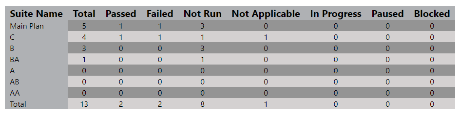
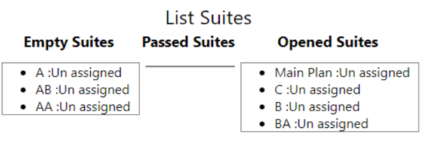

# Summery

Add to your Azure DevOps new ways to explore your test work, and improve your work analysis.
help you to get the right perspective of each Tes Plan

# Analayz Your Tests

Analyze the information with spectacular and interactive graphs

# Get Test Plan Detaily Info

You can see a fully details of your tests and its results, easly explore them

# Watch Test Suite Details

Get the most Precise information of your test suit

# Export Your Data

You can export your test plan data easily, and get them on a simple csv file.

# Fine tuning 

by changing the Deep check box, you can determit how deep in the Suites tree you want to show in the Chart

# Suite Lists (Empty/Full Pass/In progress)

you can find all your empty, full passed and in progress suites in one list so it wont harm your Charts

# Pies Suite View - Total Test Plane / Selected Suite Isolated / Selected Suite include inner suites

by clicking on one suite in the chrat, you get two Pies chart of this single.

# Isolated/Include Sub Suites view

using this toggle button you can switch the graph suite view

# DrillDown into TestCases

by clicking the selected suite pies, you can get a drill down view of the Test case in the state you select

contact me avih75@gmail.com